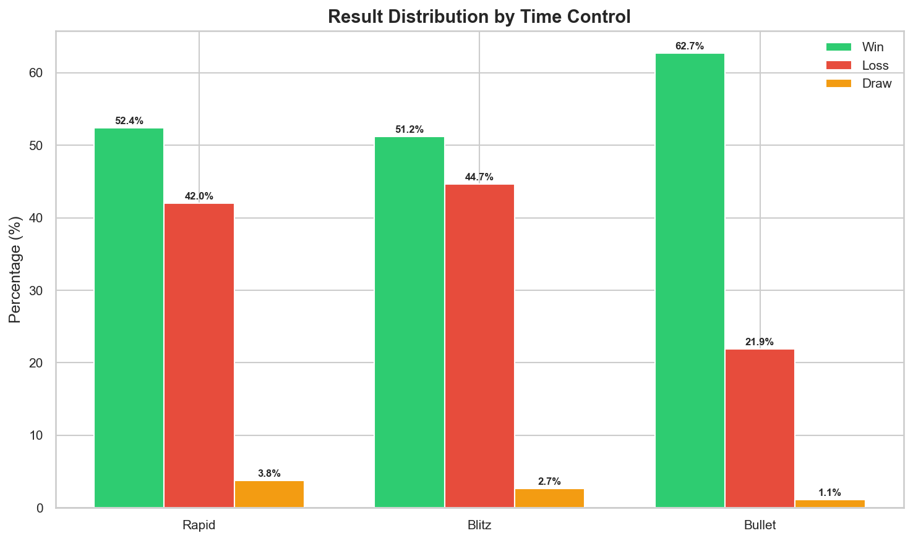

# ♟️ Chess.com Performance Analysis

## Project Overview

| Category | Details |
|---|---|
| Project Type | Data Analysis Case Study |
| Tools Used | Python, Pandas, Matplotlib, Seaborn, Jupyter |
| Dataset | Chess.com Game Data via Public API |
| Focus | Opening Repertoire, Color Performance, Rating Progression |
| Goal | Identify weaknesses and generate improvement recommendations |

Dataset Source: Chess.com Public API (Fareed04)

---

## Executive Summary

This project analyzes **3,254 rated games** played on Chess.com from
March 2023 to March 2026 across Bullet, Blitz, and Rapid time controls.

The goal is to identify performance patterns across openings, colors,
and time controls and generate **data-driven recommendations** for
targeted improvement toward rating goals of 2000 (Rapid), 1500 (Blitz),
and 1500 (Bullet).

The analysis reveals that:

- Performance is **consistently stronger with White pieces** across all formats
- The **Scandinavian Defense** accounts for 26% of all games but produces
  only a 48.8% win rate — the single biggest opening weakness by volume
- **Kings Fianchetto** is the weakest opening on both sides by win rate
  and accuracy
- **Accuracy reliably predicts outcomes** — a 9 point gap exists between
  wins and losses across all formats
- **Rapid is the strongest and most consistently improving format**,
  currently at an all time peak of 1,476

Built to be fully reproducible — any Chess.com user can substitute
their own username to replicate the full analysis pipeline.

---

## Key Findings

- Overall win rate of **52.1%** across 3,254 rated games
- White piece win rate (**53.5%**) outperforms Black (**50.6%**) across every format
- **Blitz as Black (49.8%)** is the weakest format and color combination
- Rapid rating has grown **+1,039 points** from 437 to 1,476 — an all time peak
- **Queens Gambit as Black (39.5%)** is the most urgent opening problem
- **Kings Fianchetto** produces 42.9% as White and 39.3% as Black with
  the lowest accuracy of any opening at 61.15%
- Winning games average **76.25% accuracy** vs 67.27% in losses

---

## Phase 1 — ASK

### Business Task

Analyze personal Chess.com game data from March 2023 to March 2026
across Bullet, Blitz, and Rapid time controls to identify performance
patterns, strengths, and weaknesses — with a focus on opening repertoire
effectiveness — in order to generate actionable recommendations for
targeted improvement toward defined rating goals.

---

### Stakeholders

**Fareed (Primary)**
Player and analyst. Seeking data-driven insights to guide opening study
and format prioritization.

**Portfolio Reviewers (Secondary)**
Evaluating the quality, structure, and reproducibility of the analysis.

---

### Success Criteria

- Clear performance differentiation by color, format, and opening
- Statistically supported opening analysis with minimum game thresholds
- Rating progression tracking toward target goals
- Polished visualizations suitable for a portfolio
- Actionable recommendations directly tied to the data

---

### Constraints

- Accuracy data available for only 20% of games
- No opponent demographic or playstyle data
- Opening analysis limited to families with 20 or more games
- Bullet sample size (102 games) limits statistical reliability

---

## Phase 2 — PREPARE

### Dataset Description

The dataset contains game-level data retrieved from the Chess.com
Public API. Each row represents a completed rated game and includes
information such as time control, opening, player ratings, game result,
accuracy scores, and timestamps.

Data was imported using the Python `requests` library and saved locally
as `chess_games_raw.csv` before any processing.

---

### Data Organization
```
chess-performance-analysis
│
├── data
│   ├── chess_games_raw.csv
│   └── chess_games_cleaned.csv
│
├── notebooks
│   ├── chess_analysis.ipynb
│
├── reports
│   └── figures
│       ├── 01_overall_result_distribution.png
│       ├── 02_winrate_by_time_control.png
│       ├── 03_winrate_by_color.png
│       ├── 04_rating_progression.png
│       ├── 05_opening_performance_white.png
│       ├── 06_opening_performance_black.png
│       └── 07_accuracy_analysis.png
│
├── scripts
│   ├── fetch_data.py
│
├── requirements.txt
├── .gitignore
└── README.md
```

---

### ROCCC Evaluation

**Reliable**
Data pulled directly from Chess.com's official public API with no
third-party intermediaries.

**Original**
First-party data sourced directly from the platform.

**Comprehensive**
Covers all rated games across the full account history from March
2023 to March 2026.

**Current**
Data reflects games up to March 2026.

**Cited**
Source: [Chess.com Public API](https://www.chess.com/news/view/published-data-api)
accessed in accordance with Chess.com's
[Terms of Service](https://www.chess.com/legal/user-agreement).

---

## Phase 3 — PROCESS

### Data Cleaning and Feature Engineering

After loading the raw dataset the following transformations were applied:

**3,257 raw records → 3,254 cleaned records**

---

### Column Reduction

11 irrelevant or mostly null columns were dropped, reducing the dataset
from 26 to 15 columns. Columns removed included internal IDs, redundant
API URLs, and fields with over 94% null values.

---

### Daily Game Removal

3 daily (correspondence) games were removed as they fall outside the
scope of this analysis.

---

### Player Perspective Derivation

Since the raw data stores game information from both players'
perspectives, the following columns were derived by matching the
analyst's username:

- `player_color` — White or Black
- `player_rating` — analyst's rating at time of game
- `opponent_rating` — opponent's rating at time of game
- `result` — Win / Draw / Loss from the analyst's perspective

---

### Opening Name Extraction

Opening names were embedded in ECO URLs. A custom function using
Python's `re` library extracted and cleaned the opening name from
each URL slug. An `opening_family` column was engineered by taking
the first two words of the opening name for higher-level grouping.

- **Unique openings identified:** 456

---

### Date Engineering

Unix timestamps were converted to datetime. Additional columns derived:
`year`, `month`, `month_year`, `day_of_week`.

---

### Accuracy Derivation

Accuracy scores were assigned from the analyst's perspective based on
color played. Chess.com only provides accuracy for reviewed games.

| | Games |
|---|---|
| Games with accuracy data | 653 (20.1%) |
| Games without accuracy data | 2,601 (79.9%) |

---

### Cleaning Impact

| Metric | Value |
|---|---|
| Initial records | 3,257 |
| Records removed | 3 |
| Final dataset | 3,254 games |
| Final columns | 18 |
| Null values (excl. accuracy) | 0 |

---

## Phase 4 — ANALYZE

### Overall Performance

| Result | Games | % |
|---|---|---|
| Win | 1,694 | 52.1% |
| Loss | 1,451 | 44.6% |
| Draw | 109 | 3.3% |

---

### Performance by Color

| Color | Win % | Loss % |
|---|---|---|
| White | 53.5% | 43.1% |
| Black | 50.6% | 46.1% |

White outperforms Black across every format. The gap is largest in
Bullet (13.8%) and smallest in Rapid (2.4%). Blitz as Black (49.8%)
is the weakest format and color combination in the dataset.

---

### Rating Progression

| Format | Start | Peak | Current | Net |
|---|---|---|---|---|
| Rapid | 437 | 1,476 | 1,476 | +1,039 |
| Blitz | 483 | 979 | 979 | +496 |
| Bullet | 697 | 893 | 754 | +57 |

Rapid and Blitz are both at all time peaks. Bullet peaked at 893 in
October 2025 and has since regressed 139 points due to inconsistent
play volume.

---

### Opening Performance (min 20 games)

**As White**
| | Best | Win % | | Worst | Win % |
|---|---|---|---|---|---|
| 1 | Englund Gambit | 55.8% | 1 | Kings Fianchetto | 42.9% |
| 2 | Queens Pawn | 55.3% | 2 | Modern Defense | 43.8% |
| 3 | French Defense | 52.2% | 3 | Old Benoni | 44.4% |

**As Black**
| | Best | Win % | | Worst | Win % |
|---|---|---|---|---|---|
| 1 | Van't Kruijs | 67.7% | 1 | Kings Fianchetto | 39.3% |
| 2 | Nimzowitsch Larsen | 61.5% | 2 | Queens Gambit | 39.5% |
| 3 | Alekhine's Defense | 53.3% | 3 | English Opening | 40.0% |

The Scandinavian Defense is the most critical finding — 853 games
(26% of all games) at only 48.8% win rate.

---

### Accuracy Analysis
*Based on 653 games with accuracy data (20.1% of total dataset)*

| Result | Avg Accuracy |
|---|---|
| Win | 76.25% |
| Draw | 77.57% |
| Loss | 67.27% |

A consistent 9 point accuracy gap exists between wins and losses.
Kings Fianchetto has the lowest average accuracy at 61.15%, nearly
13 points below any other opening.

---

## Phase 5 — SHARE

### Key Insights

**Overall Performance**
A 52.1% win rate confirms a positive overall record, but a 44.6%
loss rate leaves clear room for improvement.

**Color Performance**
White piece play is stronger across every format. Improving Black
piece play — particularly in Blitz — is the highest-leverage
opportunity for overall rating improvement.

**Rating Progression**
Rapid and Blitz are growing consistently and are both at all time
peaks. Bullet is declining due to irregular play volume.

**Opening Repertoire**
The Scandinavian Defense is the most played and most impactful
opening to improve. Queens Gambit as Black and Kings Fianchetto on
both sides are the most urgent problems.

**Accuracy**
Accuracy is a reliable predictor of results. Reducing blunders in
key positions will directly translate to better outcomes regardless
of the opening played.

---

### Visualizations

#### Chart 1 — Overall Result Distribution


#### Chart 2 — Win Rate by Time Control


#### Chart 3 — Win Rate by Color and Time Control


#### Chart 4 — Rating Progression by Time Control


#### Chart 5 — Opening Performance as White


#### Chart 6 — Opening Performance as Black


#### Chart 7 — Accuracy Analysis


---

## Phase 6 — ACT

### Recommendations

**1. Study the Scandinavian Defense**
853 games at 48.8% win rate makes this the single highest return
on investment study activity available. Learning key variations and
middlegame plans would have an outsized impact on overall results.

**2. Address Queens Gambit as Black**
A 39.5% win rate across 76 statistically reliable games means more
games are lost than won here. Learning the Queens Gambit Declined
and Accepted defensive ideas is an immediate priority.

**3. Study or replace Kings Fianchetto**
42.9% as White, 39.3% as Black, and the lowest accuracy of any
opening at 61.15% confirms this as the least understood opening in
the current repertoire.

**4. Maintain the Queens Pawn system as White**
55.3% win rate across 1,008 games makes it the strongest asset in
the repertoire. Deepening knowledge of its key variations will
protect and extend this advantage.

**5. Prioritize Rapid and Blitz over Bullet**
Focus game volume on the two formats where ratings are actively
climbing. Defer Bullet until higher targets in Rapid and Blitz are
closer to being achieved.

---

### Further Exploration

- Win rate analysis segmented by opponent rating band
- Performance trends by time of day and day of week
- Opening win rate trends over time to measure study impact
- Game termination breakdown (checkmate vs timeout vs resignation)

---

## Tools Used

- Python
- Pandas
- Matplotlib
- Seaborn
- Jupyter Notebook
- Git / GitHub