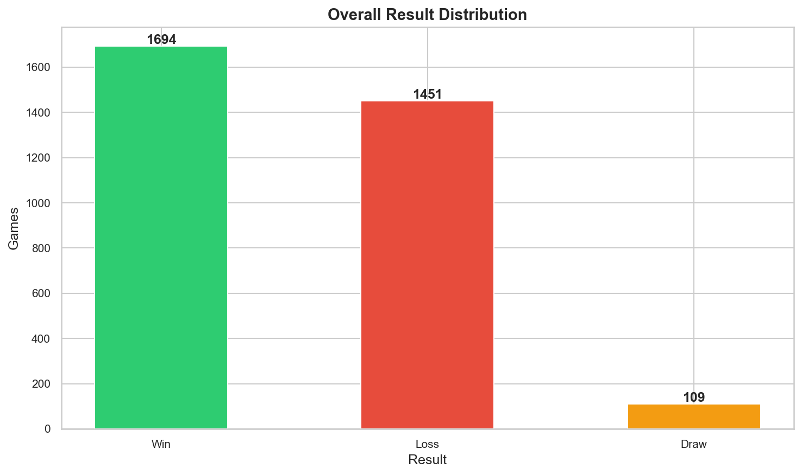
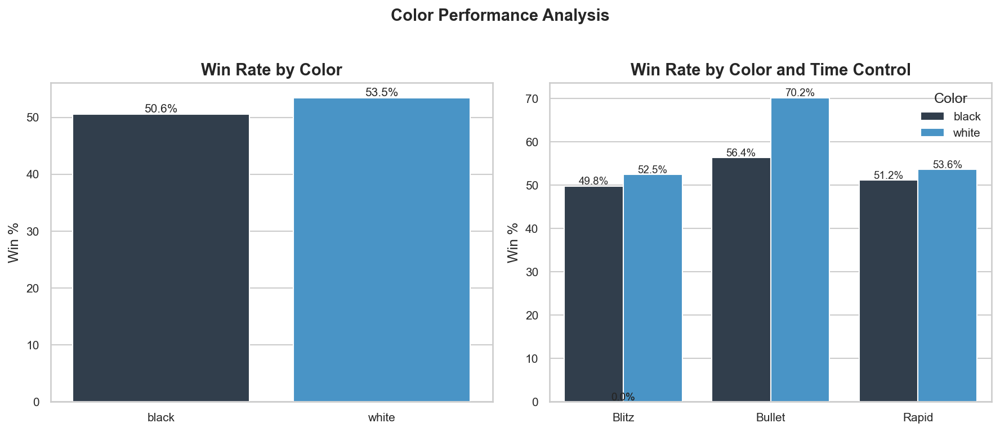
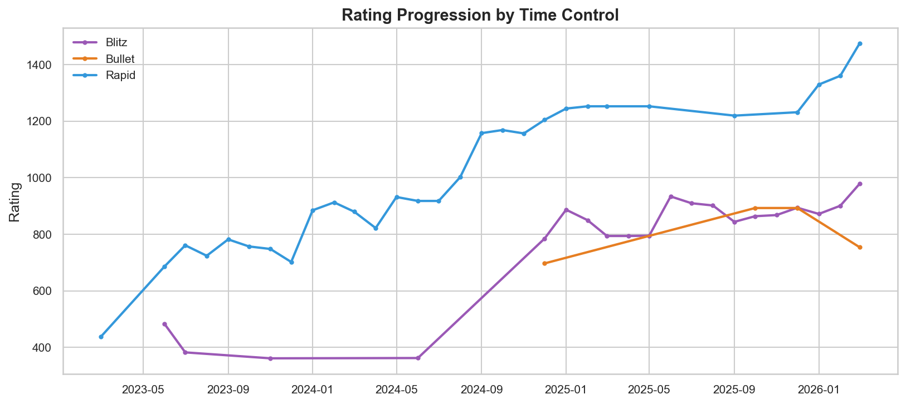
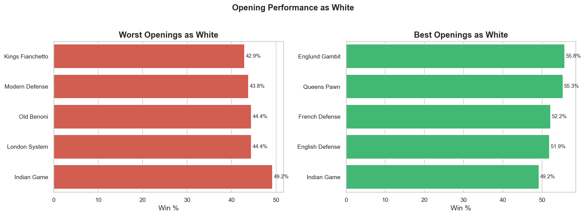
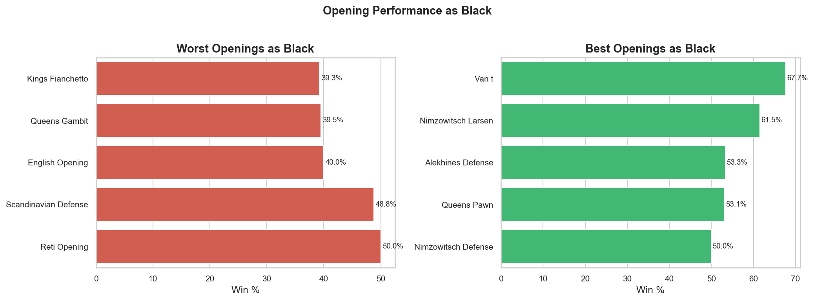
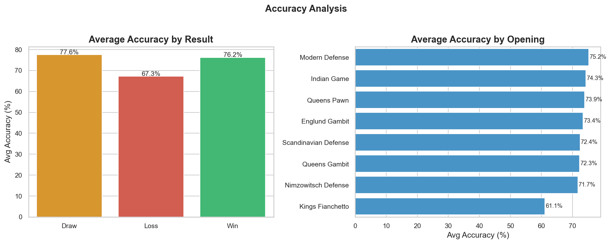

# ♟️ Chess.com Performance Analysis

## Phase 1: Ask

### Business Task Statement

**Client:** Fareed (Chess.com player) — acting as both analyst and client.

**Business Task:**
Analyze personal Chess.com game data from March 2024 to present across 
Bullet, Blitz, and Rapid time controls to identify performance patterns, 
strengths, and weaknesses — with a focus on opening repertoire 
effectiveness — in order to generate actionable recommendations for 
targeted improvement toward rating goals of 2000 (Rapid), 1500 (Blitz), 
and 1500 (Bullet).

---

### Key Factors Being Investigated
- Win/loss/draw rates by time control, color (White/Black), and opening
- Accuracy trends over time and across openings
- Rating progression toward target ratings
- Openings where performance is strongest and weakest (both as White and Black)

---

### Metrics
- Win rate %, Loss rate %, Draw rate %
- Average accuracy per opening / time control
- Rating delta over time (progression curve)
- Performance split by color (White vs Black)

---

### Guiding Questions
1. What type of company does your client represent, and what are they asking you to accomplish?
2. What are the key factors involved in the business task you are investigating?
3. What type of data will be appropriate for your analysis?
4. Where will you obtain that data?
5. Who is your audience, and what materials will help you present to them effectively?

---

### Stakeholders
- **Primary:** Fareed (player and analyst)
- **Secondary:** Portfolio reviewers

---

### Deliverable
A clear statement of the business task has been defined above. The analysis 
will be fully reproducible — any Chess.com user can substitute their own 
username to replicate the full analysis pipeline.

## Phase 2: Prepare

### Data Source
- **Platform:** Chess.com
- **Access Method:** Chess.com Public API via Python `requests` library
- **Data Format:** CSV (saved locally after API import)
- **Dataset:** `chess_games_raw.csv`
- **Time Period:** March 2023 – March 2026
- **Total Records:** 3,257 games

---

### Dataset Structure
| Column | Description |
|---|---|
| `url` | Link to the game on Chess.com |
| `pgn` | Full game notation including opening, moves, and metadata |
| `time_control` | Time control in seconds |
| `time_class` | Time control category (bullet, blitz, rapid, daily) |
| `end_time` | Unix timestamp of when the game ended |
| `rated` | Whether the game was rated |
| `eco` | URL containing the ECO opening code and name |
| `accuracies.white` | Accuracy score for White (where available) |
| `accuracies.black` | Accuracy score for Black (where available) |
| `white.username` | Username of the player with the White pieces |
| `white.rating` | Rating of the White player at the time of the game |
| `white.result` | Result for the White player |
| `black.username` | Username of the player with the Black pieces |
| `black.rating` | Rating of the Black player at the time of the game |
| `black.result` | Result for the Black player |
| `uuid` | Unique game identifier |
| `fen` | Final board position in FEN notation |
| `tournament` | Tournament ID (mostly null — not applicable) |
| `start_time` | Unix timestamp of game start (mostly null) |

---

### Game Breakdown by Time Control
| Time Class | Games |
|---|---|
| Blitz | 1,722 |
| Rapid | 1,430 |
| Bullet | 102 |
| Daily | 3 |
| **Total** | **3,257** |

---

### ROCCC Assessment
| Criteria | Assessment |
|---|---|
| **Reliable** | Data pulled directly from Chess.com's official public API — no third-party intermediaries |
| **Original** | First-party data sourced directly from the platform |
| **Comprehensive** | Covers all game types across the full account history |
| **Current** | Data reflects games up to March 2026 |
| **Cited** | Source: [Chess.com Public API](https://www.chess.com/news/view/published-data-api) |

---

### Known Limitations
- **Accuracy data is sparse:** `accuracies.white` and `accuracies.black` are null
  for approximately 80% of games (2,604 out of 3,257). Chess.com only provides
  accuracy for games that have been reviewed. Accuracy-based analysis will be
  limited to the available subset.
- **Daily games excluded:** 3 daily (correspondence) games are present in the
  dataset but will be filtered out as they fall outside the scope of this analysis.
- **Opening names not directly stored:** ECO opening names are embedded within
  URL strings and will need to be extracted during the Process phase.
- **Player color not directly stored:** Whether the analyst played as White or
  Black must be derived by matching the username against `white.username`
  and `black.username`.

---

### Licensing & Privacy
- Data was accessed via Chess.com's publicly available API in accordance with
  their [Terms of Service](https://www.chess.com/legal/user-agreement).
- The dataset contains only publicly visible game data. No private or sensitive
  user information is included.
- This project is intended for personal portfolio use and educational purposes only.

---

### Deliverable
A description of all data sources used has been documented above. The raw dataset
(`chess_games_raw.csv`) has been saved locally and will be preserved alongside the
cleaned version to maintain a full audit trail of the data pipeline.

## Phase 3: Process

### Tools Used
- **Language:** Python 3
- **Libraries:** `pandas`, `re`
- **Environment:** Jupyter Notebook
- **Input:** `data/chess_games_raw.csv`
- **Output:** `data/chess_games_cleaned.csv`

---

### Steps Taken

#### Step 1 — Load Raw Data
Loaded the raw CSV into a pandas DataFrame and confirmed the dataset
shape of 3,257 rows and 26 columns before any transformations.

#### Step 2 — Drop Irrelevant Columns
Removed 11 columns that were either redundant, mostly null, or
irrelevant to the analysis:

| Column | Reason Dropped |
|---|---|
| `tcn` | Encoded move notation, not needed for analysis |
| `initial_setup` | Always the standard chess starting position |
| `fen` | Final board position, not needed |
| `tournament` | 94% null, out of scope |
| `start_time` | 99.9% null |
| `white.@id` | API URL, redundant with username |
| `black.@id` | API URL, redundant with username |
| `white.uuid` | Internal ID, not needed |
| `black.uuid` | Internal ID, not needed |
| `uuid` | Internal ID, not needed |
| `rules` | All values are "chess", no variance |

Remaining columns after this step: **15**

#### Step 3 — Filter Out Daily Games
Removed 3 daily (correspondence) games as they fall outside the
scope of this analysis, which focuses on Bullet, Blitz, and Rapid
time controls.

Remaining games after this step: **3,254**

#### Step 4 — Derive Player Color and Opponent Info
Since the raw data stores game information from both players'
perspectives, the following columns were derived by matching the
analyst's username against `white.username` and `black.username`:

- `player_color` — whether the analyst played as White or Black
- `player_rating` — the analyst's rating at the time of the game
- `opponent_rating` — the opponent's rating at the time of the game
- `opponent_username` — the opponent's Chess.com username

**Color distribution:**
| Color | Games |
|---|---|
| Black | 1,633 |
| White | 1,621 |

The near-perfect split confirms no matchmaking bias in the dataset.

#### Step 5 — Derive Game Result from Player Perspective
The raw result values were mapped into three simplified categories
from the analyst's perspective:

| Category | Raw Values |
|---|---|
| Win | `win` |
| Draw | `repetition`, `stalemate`, `agreed`, `insufficient`, `timevsinsufficient` |
| Loss | `checkmated`, `resigned`, `timeout`, `abandoned` |

**Overall result distribution:**
| Result | Games |
|---|---|
| Win | 1,694 (52.1%) |
| Loss | 1,451 (44.6%) |
| Draw | 109 (3.3%) |

#### Step 6 — Parse Opening Names from ECO URLs
The `eco` column stored opening names as full URLs. A custom
function was written using `re` to extract and clean the opening
name from the URL slug.

An additional `opening_family` column was derived by taking the
first two words of the opening name, allowing for higher-level
grouping in the analysis.

- **Unique openings identified:** 456
- **Most played opening family:** Scandinavian Defense (590+ games)

#### Step 7 — Parse and Format Dates
The `end_time` Unix timestamp was converted to a datetime column.
The following additional date columns were derived for time-based
analysis:

- `date` — full datetime
- `year` — game year
- `month` — game month
- `month_year` — period for monthly trend analysis
- `day_of_week` — day the game was played

**Games per year:**
| Year | Games |
|---|---|
| 2023 | 317 |
| 2024 | 1,070 |
| 2025 | 1,459 |
| 2026 | 408 |

#### Step 8 — Derive Accuracy from Player Perspective
Accuracy scores were assigned from the analyst's perspective based
on color played, producing two new columns:

- `player_accuracy` — analyst's accuracy for that game
- `opponent_accuracy` — opponent's accuracy for that game

**Accuracy availability:**
| | Games |
|---|---|
| Games with accuracy data | 653 (20.1%) |
| Games without accuracy data | 2,601 (79.9%) |
| Average accuracy where available | 72.84% |

Note: Chess.com only provides accuracy scores for reviewed games.
Accuracy-based analysis will be clearly scoped to the available
subset throughout this project.

#### Step 9 — Final Cleanup and Export
Raw columns replaced by cleaner derived versions were dropped.
All remaining columns were reordered logically for analysis.

---

### Cleaned Dataset Summary
| Property | Value |
|---|---|
| Total games | 3,254 |
| Total columns | 18 |
| Null values (excl. accuracy) | 0 |
| Output file | `data/chess_games_cleaned.csv` |

---

### Deliverable
All cleaning and transformation steps have been documented above.
Both the raw file (`chess_games_raw.csv`) and the cleaned file
(`chess_games_cleaned.csv`) are preserved in the `data/` folder
to maintain a full audit trail of the data pipeline.

## Phase 4: Analyze

### Tools Used
- **Language:** Python 3
- **Libraries:** `pandas`
- **Environment:** Jupyter Notebook
- **Input:** `data/chess_games_cleaned.csv`

---

### Section 1 — Overall Performance Summary

**Overall result distribution across 3,254 games:**
| Result | Games | Percentage |
|---|---|---|
| Win | 1,694 | 52.1% |
| Loss | 1,451 | 44.6% |
| Draw | 109 | 3.3% |

**Results by time control:**
| Time Control | Games | Win % | Loss % | Draw % |
|---|---|---|---|---|
| Rapid | 1,430 | 52.4% | 43.6% | 4.1% |
| Blitz | 1,722 | 51.2% | 46.0% | 2.8% |
| Bullet | 102 | 62.7% | 35.3% | 2.0% |

**Key findings:**
- Overall win rate of 52.1% confirms more games are won than lost
  across all formats
- Bullet win rate (62.7%) is the highest but is based on only 102
  games and should be interpreted with caution
- Blitz is the most played format and also the weakest by win rate
  at 51.2%
- Draw rate increases with time control, peaking at 4.1% in Rapid,
  consistent with longer games producing more defensive play

---

### Section 2 — Performance by Color

**Overall results by color:**
| Color | Games | Win % | Loss % | Draw % |
|---|---|---|---|---|
| White | 1,621 | 53.5% | 43.1% | 3.5% |
| Black | 1,633 | 50.6% | 46.1% | 3.2% |

**Results by color and time control:**
| Time Control | Color | Win % | Loss % | Total |
|---|---|---|---|---|
| Blitz | White | 52.5% | 44.8% | 867 |
| Blitz | Black | 49.8% | 47.3% | 855 |
| Bullet | White | 70.2% | 27.7% | 47 |
| Bullet | Black | 56.4% | 41.8% | 55 |
| Rapid | White | 53.6% | 42.0% | 707 |
| Rapid | Black | 51.2% | 45.1% | 723 |

**Key findings:**
- White piece performance (53.5%) consistently outperforms Black
  (50.6%) across all time controls, a 2.9% gap overall
- Blitz as Black (49.8% win rate) is the weakest combination in
  the dataset, the only format and color combination where losses
  nearly equal wins
- The White vs Black performance gap is largest in Bullet (13.8%)
  and smallest in Rapid (2.4%), suggesting Rapid play is the most
  color-balanced format
- The near equal color distribution (1,621 White vs 1,633 Black)
  confirms no matchmaking bias in the dataset

---

### Section 3 — Rating Progression

**Overall rating growth:**
| Time Control | Start | Peak | Current | Net Change |
|---|---|---|---|---|
| Rapid | 437 | 1,476 | 1,476 | +1,039 |
| Blitz | 483 | 979 | 979 | +496 |
| Bullet | 697 | 893 | 754 | +57 |

**Monthly average rating (last 6 months):**
| Month | Rapid | Blitz | Bullet |
|---|---|---|---|
| Sep 2025 | 1,213 | 842 | N/A |
| Oct 2025 | N/A | 867 | 834 |
| Nov 2025 | N/A | 867 | N/A |
| Dec 2025 | 1,223 | 893 | 893 |
| Jan 2026 | 1,271 | 887 | N/A |
| Feb 2026 | 1,346 | 901 | N/A |
| Mar 2026 | 1,414 | 964 | 683 |

**Key findings:**
- Rapid is the strongest and most consistently improving format,
  with a +1,039 net rating gain representing more than a tripling
  of the starting rating. Currently at an all time peak of 1,476
- Blitz shows a steady upward trend over the last 6 months
  (842 to 964), also currently at an all time peak of 979
- Bullet tells a different story. After peaking at 893 in October
  2025, the rating has since dropped to 754, a regression of 139
  points. Inconsistent play volume (gaps in monthly data) likely
  contributes to this instability
- Activity is growing year over year: 317 games in 2023, 1,070
  in 2024, and 1,459 in 2025, indicating increasing engagement
  with the game

---

### Section 4 — Opening Analysis

**Top opening families by games played:**
| Opening Family | Games | Win % | Loss % |
|---|---|---|---|
| Queens Pawn | 1,349 | 54.7% | 41.5% |
| Scandinavian Defense | 853 | 48.8% | 47.7% |
| Indian Game | 187 | 48.1% | 49.2% |
| Englund Gambit | 148 | 55.4% | 41.9% |
| Queens Gambit | 76 | 39.5% | 60.5% |
| Nimzowitsch Defense | 71 | 50.7% | 49.3% |

**Best performing opening families as White (min 20 games):**
| Opening | Games | Win % |
|---|---|---|
| Englund Gambit | 147 | 55.8% |
| Queens Pawn | 1,008 | 55.3% |
| French Defense | 23 | 52.2% |
| English Defense | 27 | 51.9% |

**Worst performing opening families as White (min 20 games):**
| Opening | Games | Win % |
|---|---|---|
| Kings Fianchetto | 21 | 42.9% |
| Modern Defense | 48 | 43.8% |
| Old Benoni | 45 | 44.4% |
| London System | 27 | 44.4% |

**Best performing opening families as Black (min 20 games):**
| Opening | Games | Win % |
|---|---|---|
| Van't Kruijs | 31 | 67.7% |
| Nimzowitsch Larsen | 26 | 61.5% |
| Alekhine's Defense | 45 | 53.3% |
| Queens Pawn | 341 | 53.1% |

**Worst performing opening families as Black (min 20 games):**
| Opening | Games | Win % |
|---|---|---|
| Kings Fianchetto | 28 | 39.3% |
| Queens Gambit | 76 | 39.5% |
| English Opening | 25 | 40.0% |
| Scandinavian Defense | 853 | 48.8% |

**Key findings:**
- Queens Pawn is the backbone of the White repertoire, played in
  1,008 games with a solid 55.3% win rate
- The Scandinavian Defense is the most critical finding in the
  entire analysis. It accounts for 853 games (26% of all games)
  as the primary Black response, yet produces only a 48.8% win
  rate. This is the single biggest area for improvement
- Queens Gambit as Black is the most urgent problem by win rate,
  producing only 39.5% wins across 76 statistically reliable games
- Kings Fianchetto is a weakness on both sides, producing 42.9%
  as White and 39.3% as Black, making it a clear candidate for
  study or avoidance
- Van't Kruijs (67.7% as Black) and Nimzowitsch Larsen (61.5% as
  Black) are strong performers but are based on smaller sample
  sizes (31 and 26 games respectively) and should be interpreted
  with appropriate caution

---

### Section 5 — Accuracy Analysis
*Note: Based on 653 games with accuracy data, representing 20.1%
of the total dataset. Chess.com only provides accuracy for
reviewed games. Findings should be interpreted as indicative
rather than fully representative.*

**Average accuracy by result:**
| Result | Games | Avg Accuracy | Min | Max |
|---|---|---|---|---|
| Win | 376 | 76.25% | 33.0% | 100% |
| Draw | 25 | 77.57% | 59.3% | 89.6% |
| Loss | 252 | 67.27% | 25.0% | 100% |

**Average accuracy by time control:**
| Time Control | Games | Avg Accuracy |
|---|---|---|
| Rapid | 452 | 73.16% |
| Bullet | 15 | 72.93% |
| Blitz | 186 | 72.05% |

**Average accuracy by color:**
| Color | Games | Avg Accuracy |
|---|---|---|
| White | 324 | 74.00% |
| Black | 329 | 71.69% |

**Average accuracy by result and time control:**
| Time Control | Win | Draw | Loss |
|---|---|---|---|
| Rapid | 76.41% | 78.12% | 67.52% |
| Blitz | 75.84% | 75.53% | 66.93% |
| Bullet | 76.23% | 77.40% | 63.55% |

**Top openings by average accuracy (min 10 games):**
| Opening | Games | Avg Accuracy |
|---|---|---|
| Modern Defense | 15 | 75.24% |
| Indian Game | 50 | 74.29% |
| Queens Pawn | 269 | 73.93% |
| Englund Gambit | 29 | 73.40% |
| Scandinavian Defense | 157 | 72.43% |
| Queens Gambit | 20 | 72.30% |
| Nimzowitsch Defense | 11 | 71.72% |
| Kings Fianchetto | 11 | 61.15% |

**Key findings:**
- A consistent ~9 point accuracy gap exists between wins (76.25%)
  and losses (67.27%), confirming that accuracy is a strong
  predictor of game outcome across all formats
- Accuracy is remarkably consistent across time controls
  (72.05% to 73.16%), suggesting performance does not degrade
  significantly under time pressure
- White accuracy (74.00%) outperforms Black accuracy (71.69%) by
  2.31 points, consistent with the win rate advantage seen in
  Section 2
- Kings Fianchetto has the lowest average accuracy at 61.15%,
  nearly 13 points below Modern Defense. Combined with poor win
  rates on both sides from Section 4, this confirms Kings
  Fianchetto as the weakest opening in the repertoire both in
  terms of understanding and results
- Scandinavian Defense accuracy (72.43%) sits below the Queens
  Pawn average (73.93%), partially explaining the lower win rate
  in this heavily played opening

---

### Deliverable
A summary of the analysis has been documented above across five
sections covering overall performance, color-based performance,
rating progression, opening repertoire, and accuracy trends.
Key patterns and findings have been identified and will be
translated into visualizations in the Share phase and
recommendations in the Act phase.

## Phase 5: Share

### Tools Used
- **Language:** Python 3
- **Libraries:** `matplotlib`, `seaborn`
- **Environment:** Jupyter Notebook
- **Output:** Inline display + saved to `reports/figures/`

---

### Visualizations

#### Chart 1 — Overall Result Distribution

A bar chart showing the overall distribution of wins, losses, and
draws across all 3,254 rated games. Wins account for 52.1% of all
games, confirming a positive overall record.

---

#### Chart 2 — Win Rate by Time Control

A bar chart comparing win rates across Rapid, Blitz, and Bullet.
Bullet shows the highest win rate (62.7%) but is based on a small
sample of 102 games. Blitz is the weakest format at 51.2% despite
being the most played.

---

#### Chart 3 — Win Rate by Color and Time Control

Two side by side bar charts showing win rates by color overall and
broken down by time control. White consistently outperforms Black
across all formats, with the largest gap in Bullet (13.8%) and the
smallest in Rapid (2.4%). Blitz as Black (49.8%) is the weakest
combination in the entire dataset.

---

#### Chart 4 — Rating Progression by Time Control

A line chart tracking monthly rating progression across all three
time controls from March 2023 to March 2026. Rapid shows the
strongest and most consistent upward trend (+1,039 net gain).
Blitz is steadily climbing (+496). Bullet peaked in October 2025
and has since regressed by 139 points.

---

#### Chart 5 — Opening Performance as White

Side by side horizontal bar charts showing the best and worst
performing opening families as White (minimum 20 games). The
Englund Gambit (55.8%) and Queens Pawn (55.3%) are the strongest
performers. Kings Fianchetto (42.9%) and Modern Defense (43.8%)
are the weakest.

---

#### Chart 6 — Opening Performance as Black

Side by side horizontal bar charts showing the best and worst
performing opening families as Black (minimum 20 games). Van't
Kruijs (67.7%) and Nimzowitsch Larsen (61.5%) lead as the best
performers. Kings Fianchetto (39.3%) and Queens Gambit (39.5%)
are the most problematic openings.

---

#### Chart 7 — Accuracy Analysis

Side by side bar charts showing average accuracy by result and by
opening family. A consistent 9 point accuracy gap exists between
wins (76.25%) and losses (67.27%). Kings Fianchetto has the lowest
average accuracy at 61.15%, nearly 13 points below the next lowest
opening, confirming it as the least understood opening in the
current repertoire.

---

### Key Findings
- White piece play (53.5%) consistently outperforms Black (50.6%)
  across all formats
- Blitz as Black is the weakest combination at 49.8% win rate
- Rapid is the strongest and most consistently improving format
  with a current all time peak rating of 1,476
- The Scandinavian Defense accounts for 26% of all games yet
  produces only a 48.8% win rate — the single biggest opening
  weakness by volume
- Queens Gambit as Black has the worst statistically reliable win
  rate at 39.5% across 76 games
- Kings Fianchetto is a weakness on both sides by win rate and
  accuracy
- Accuracy is a strong predictor of results with a 9 point gap
  between wins and losses across all formats

---

### Deliverable
Supporting visualizations and key findings have been documented
above. All charts have been saved to `reports/figures/` and are
embedded inline in the notebook for presentation purposes.

## Phase 6: Act

### Final Conclusions

The analysis of 3,254 rated Chess.com games from March 2023 to March
2026 reveals clear and measurable patterns in performance across
openings, colors, time controls, and accuracy. The data tells a
consistent story: the gap between winning and losing is closely tied
to opening preparation and piece color, not time pressure.

---

### Top High-Level Insights

1. **White outperforms Black across every format.** With a 53.5% win
   rate as White versus 50.6% as Black, and a loss rate that is 3
   points higher as Black, improving Black piece play represents the
   single highest-leverage opportunity for overall rating improvement.

2. **Blitz as Black is the weakest combination in the dataset.** A
   49.8% win rate in the most played format (855 games) means nearly
   as many games are lost as won in this specific scenario. Targeted
   improvement here would have the most immediate impact on the
   overall Blitz rating.

3. **The Scandinavian Defense is the most critical opening to study.**
   It accounts for 26% of all games (853 games) as the primary Black
   response yet produces only a 48.8% win rate. Given the volume of
   games played in this opening, even a modest improvement in win rate
   here would significantly impact overall results.

4. **The Queens Gambit as Black is the most urgent problem by win
   rate.** A 39.5% win rate across 76 statistically reliable games
   means more games are lost than won in this opening. Studying the
   key defensive lines and ideas in the Queens Gambit should be an
   immediate priority.

5. **Kings Fianchetto is a weakness on both sides.** With a 42.9%
   win rate as White and 39.3% as Black, combined with the lowest
   average accuracy of any opening at 61.15%, this opening exposes
   the most gaps in positional understanding. It should either be
   studied thoroughly or avoided entirely until a stronger foundation
   is built.

6. **Accuracy is a strong and consistent predictor of results.** A
   9 point accuracy gap exists between wins (76.25%) and losses
   (67.27%) across all formats. Reducing blunders and improving
   calculation in critical positions will directly translate to
   better results regardless of the opening played.

7. **Rapid is the strongest and most consistently improving format.**
   A +1,039 rating gain and a current all time peak of 1,476
   demonstrates that deeper calculation and longer thinking time
   brings out the best in the current playing style. Lessons learned
   in Rapid should be applied to Blitz improvement.

8. **Bullet is inconsistent and declining.** A 139 point regression
   since the October 2025 peak, combined with irregular play volume,
   suggests Bullet should be deprioritized until Blitz and Rapid
   targets are closer to being achieved.

---

### Recommendations

1. **Study the Scandinavian Defense deeply.** Learn the key
   variations, typical middlegame plans, and common tactical
   patterns. Given the volume of games in this opening, this is
   the highest return on investment activity available.

2. **Learn the Queens Gambit defensive lines as Black.** Focus on
   understanding the key ideas behind the Queens Gambit Declined
   and Queens Gambit Accepted to stop the current 39.5% win rate
   from persisting.

3. **Address the Kings Fianchetto on both sides.** Either study the
   positional ideas behind this opening thoroughly or replace it
   with better understood alternatives. The 61.15% accuracy in this
   opening confirms it is the least understood opening in the current
   repertoire.

4. **Maintain and build on the Queens Pawn system as White.** With
   a 55.3% win rate across 1,008 games it is clearly the strongest
   part of the current repertoire. Deepening knowledge of its key
   variations will help defend and extend this advantage.

5. **Prioritize Rapid and Blitz over Bullet.** Focus game volume on
   the two formats where ratings are actively climbing and defer
   Bullet until higher rated targets in Rapid and Blitz are achieved.

---

### Additional Deliverables for Further Exploration

- **Opponent rating analysis:** Examine how win rates change against
  higher and lower rated opponents to identify performance ceilings
  and floors at each rating band
- **Time of day analysis:** Investigate whether performance varies
  by time of day or day of week to identify optimal playing conditions
- **Game length analysis:** Analyze whether shorter or longer games
  correlate with better results across different opening families
- **Trend analysis by opening over time:** Track whether win rates
  in key openings like the Scandinavian Defense are improving or
  declining over time to measure the impact of study and practice
- **Termination type analysis:** Break down how games are being lost
  (checkmate, timeout, resignation) to identify whether time
  management or calculation is the bigger issue

---

### Deliverable
Top high-level insights and recommendations have been documented
above based on the full analysis. The next step is to publish this
case study to a portfolio, write a brief project summary, and begin
acting on the opening study recommendations identified in the data.